<!-- ============================================================= -->
<!-- Put hero.svg inside an "assets" folder in this repo, so the    -->
<!-- path below (./assets/hero.svg) resolves. Everything animates    -->
<!-- natively on GitHub - no GIF, no external service needed.        -->
<!-- ============================================================= -->

  

  
  &nbsp;
  
  &nbsp;
  
  &nbsp;
  

 

  <code>Power BI</code> &nbsp;·&nbsp; <code>Python</code> &nbsp;·&nbsp; <code>SQL</code> &nbsp;·&nbsp; <code>Laravel</code> &nbsp;·&nbsp; <code>React</code> &nbsp;·&nbsp; <code>Node.js</code>

 

<h3 align="center">Selected Work</h3>

  <strong>FastPass</strong> &nbsp;—&nbsp; Facial-recognition tourism platform · Laravel 11 · React · FastAPI/DeepFace 
  <strong>EduPass</strong> &nbsp;—&nbsp; Event credentialing built on the same DeepFace back-end 
  <strong>franciscopedro.dev</strong> &nbsp;—&nbsp; Personal portfolio

 

  

