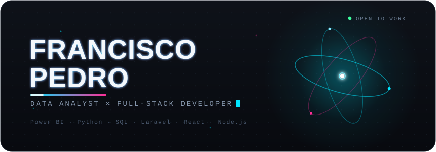

<div align="center">
  
</div>

<p align="center">
  <i>I turn messy data into clear decisions — and ideas into products that ship.</i>
</p>

<p align="center">
  <a href="https://www.linkedin.com/in/francisco-pedro-5150492ba/"></a>
  &nbsp;
  <a href="mailto:pedro2006francisco@gmail.com"></a>
  &nbsp;
  <a href="https://franciscopedro-dev.vercel.app"></a>
</p>

<br/>

```sql
SELECT project, what_it_does
FROM francisco.things_i_built;
```

```
+----------------------+----------------------------------------------------------+
| project              | what_it_does                                             |
+----------------------+----------------------------------------------------------+
| FastPass             | You show up, the camera knows you, you're in.            |
| Face Recognition API | Never forgets a face. That's literally its only job.     |
| Smart Cart           | A shopping cart that sees what you drop in it.           |
| EduPass              | The school bus checks your face, not your excuses.       |
| Reviva               | Locks your memories until the date you pick. No peeking. |
+----------------------+----------------------------------------------------------+
5 rows in set (0.01 sec) -- more loading...
```

<sub>currently: debugging something that worked yesterday</sub>
